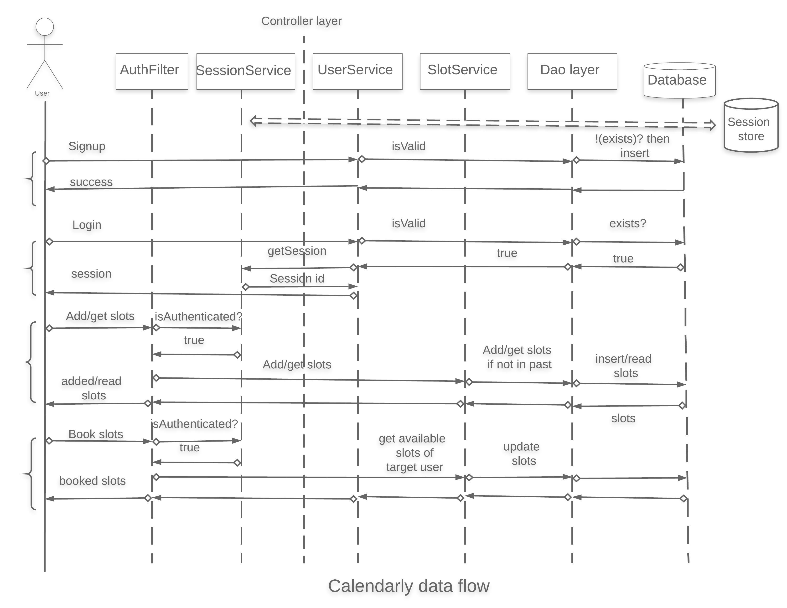
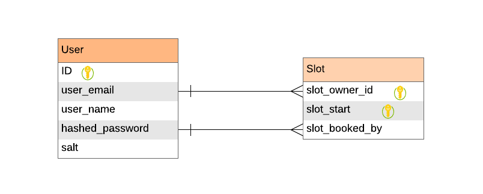

Introduction
------------

This is a calendar-booking application.

Functional tests and APIs are written as a part of the following Postman collection.

[](https://app.getpostman.com/run-collection/5b67adc20c80dff9d781)

This app is currently running at Heroku [here](https://calendarly-app.herokuapp.com/calendarly/health).

It is assumed that the slots are hourly in length. The database model is in schema.sql which is executed during startup.

Features:

1. Uses an in-memory session implementation.
2. Uses in-memory H2 database.
3. Runs on Spring Boot.
4. Uses Spring Data R2DBC (reactive RDBMS driver) for database management.

Data flow diagram
-----------------


ER diagram
------------


API documentation
-----------------
1. Register user

We provide a unique email address, a name and a password to the API and the user is registered if it does not already exist.

```
curl --location --request POST 'https://calendarly-app.herokuapp.com/calendarly/user/signup' \
--header 'Content-Type: application/json' \
--data-raw '{
	"version":1.0,
	"timestamp": "2020-04-02@15:30:00.000+0530",
	"name":"Zafar Ansari",
	"email": "zafar142007@google.com",
	"password":"pass@098"
}'
```

Response:

```
{
    "timestamp": "2020-04-04@19:53:57.912+0000",
    "version": 1.0,
    "message": "Success",
    "userRegistered": true
}
```

2. Login user

We provide an already registered email address and its password to the API, and the user is logged in if the authentication is successful. The response contains a sessionId which has to be provided in all future requests for this user as a header parameter.

```
curl --location --request POST 'https://calendarly-app.herokuapp.com/calendarly/user/login' \
--header 'Content-Type: application/json' \
--data-raw '{
	"version":1.0,
	"timestamp": "2020-04-02@15:30:00.000+0530",
	"email": "zafar142007@gmail.com",
	"password":"pass@098"
}'
```

Response:

```
{
    "timestamp": "2020-04-04@20:13:04.261+0000",
    "version": 1.0,
    "message": "Success",
    "sessionId": "XjU9iXBWxu8V9It"
}
```

3. Add slots

We provide the session id got in the login step as a header, and a list of timestamps representing the starts of available slots that we want to add for the logged-in user. If authenticated and not in the past, the slots are added as 'available' for the user. If a booked slot already exists which is also in the requested one, the slot will remain booked.

```
curl --location --request POST 'https://calendarly-app.herokuapp.com/calendarly/slot/add' \
--header 'Content-Type: application/json' \
--header 'session-id: XjU9iXBWxu8V9It' \
--data-raw '{
	"version":1.0,
	"timestamp": "2020-04-02@15:30:00.000+0530",
	"result":[
		"2020-05-02@11:00:00.000+0530",
		"2020-05-02@12:00:00.000+0530",
		"2020-05-02@19:00:00.000+0530"
		]
}'
```

Response:

```
{
    "timestamp": "2020-04-04@20:16:18.838+0000",
    "version": 1.0,
    "message": "Success"
}
```

4. Get slots

We provide the session id got in the login step as a header, a target user's email address, and a range of timestamps between which we want to view the available slots for the target user. If authenticated, available and not in the past, the slots are returned for the target user.

Request:

```
curl --location --request POST 'https://calendarly-app.herokuapp.com/calendarly/slot/get' \
--header 'Content-Type: application/json' \
--header 'session-id: XjU9iXBWxu8V9It' \
--data-raw '{
	"version":1.0,
	"timestamp": "2020-04-02@15:30:00.000+0530",
	"emailAddressBookee": "zafar142007@google.com",
	"fromTime":"2020-05-02@00:00:00.000+0530",
	"toTime":"2020-05-02@23:30:00.000+0530"
}'
```

Response:

```
{
    "timestamp": "2020-04-04@20:19:25.953+0000",
    "version": 1.0,
    "message": "Success",
    "result": [
        "2020-05-02@05:30:00.000+0000",
        "2020-05-02@06:30:00.000+0000",
        "2020-05-02@13:30:00.000+0000"
    ]
}
```


5. Book slots

We provide the session id got in the login step as a header, a target user's email address, and a list of timestamps representing the beginning times of the slots we want to book in the calendar of the target user. If available, not in the past, we would return the slots that were booked.

```
curl --location --request POST 'https://calendarly-app.herokuapp.com/calendarly/slot/book' \
--header 'Content-Type: application/json' \
--header 'session-id: XjU9iXBWxu8V9It' \
--data-raw '{
	"version":1.0,
	"timestamp": "2020-04-02@15:30:00.000+0530",
	"emailAddressBookee": "zafar142007@google.com",
	"result":[
		"2020-05-02@11:00:00.000+0000",
		"2020-05-02@12:00:00.000+0000",
		"2020-05-02@20:00:00.000+0530"
		]
}'
```

Response:

```
{
    "timestamp": "2020-04-04@20:23:53.952+0000",
    "version": 1.0,
    "message": "Success",
    "result": [
        "2020-05-02T11:00:00Z",
        "2020-05-02T12:00:00Z"
    ]
}
```

6. Health

Indicates if the application is up or not.

```
curl --location --request GET 'https://calendarly-app.herokuapp.com/calendarly/health
```

Response:

```
{
    "timestamp": "2020-04-04@20:37:15.236+0000",
    "version": 1.0,
    "message": "UP"
}
```

Build
------

You can build the project by 'mvn clean install' locally. Run it using java -jar target/calendarly-1.0.jar

Notes
------

1. R2DBC (the reactive driver for RDBMSs) is still in its nascent stage. It does not support a lot of
features that we take for granted in other drivers. I have not implemented the transactions and locking
that the booking API here requires (and which is present in the non-reactive version of this code).

2. There could be further optimizations done here where we could represent even the inner classes of the
incoming request objects as reactive types. I haven't done that yet, but for a truly reactive application
I think it is important to not let any flow 'cache' data. Instead every function should take reactive inputs
and give reactive outputs.

3. We should take care that there are no breaks in the chain of input and output of a reactive function.
One of the core insights I learnt in this implementation is that the client which is calling the
webservice is the ultimate subscriber to the reactive flows in our code. The client is supplying data
in a reactive request object which is then mapped to in our code via various transformations to other reactive types,
and finally returned as a reactive type to our client, who is again pulling (or subscribing) this data from the server
back towards it. So while these transformations are occurring in our code, there shouldn't be any new
reactive types created that are left unsubscribed. This was a frequent issue that is hard to debug as your
client will just keep on waiting and you won't know where your chain broke from the logs.

4. Spring webflux is not a very mature framework as of now. I struggled for a while to figure out the ways
to implement filters and context propagation. Compared to Vertx, Spring should make it more understandable
how they want the context to be used. In Vertx, it was quite straightforward to use the context to store
 things like session ids.

5. Debugging is a pain in the webflux reactive world. The data is hidden, and you cannot see the values of your variables.
It is important therefore to log as much as possible.

6. Also the functional way of writing code in Webflux is much advanced and useful than the annotations way.
So always use the functional handlers etc.